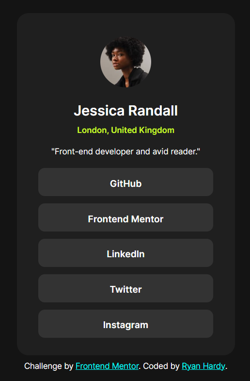
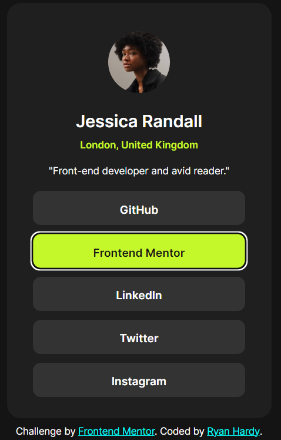

# Frontend Mentor - Social links profile solution

This is a solution to the [Social links profile challenge on Frontend Mentor](https://www.frontendmentor.io/challenges/social-links-profile-UG32l9m6dQ). Frontend Mentor challenges help you improve your coding skills by building realistic projects. 

## Table of contents

- [Frontend Mentor - Social links profile solution](#frontend-mentor---social-links-profile-solution)
    - [Table of contents](#table-of-contents)
    - [Overview](#overview)
        - [The challenge](#the-challenge)
        - [Screenshots](#screenshots)
        - [Links](#links)
    - [My process](#my-process)
        - [Built with](#built-with)
        - [What I learned](#what-i-learned)
        - [Continued development](#continued-development)
        - [Useful resources](#useful-resources)

## Overview

### The challenge

Users should be able to:

- See hover and focus states for all interactive elements on the page

### Screenshots




### Links

- Solution URL: [https://www.frontendmentor.io/solutions/social-links-profile-card-with-the-figure-element-and-some-flexbox-NxEjCpV9ld](https://www.frontendmentor.io/solutions/social-links-profile-card-with-the-figure-element-and-some-flexbox-NxEjCpV9ld)
- Live Site URL: [https://ryyhardy.github.io/frontend-mentor-social-links-profile/](https://ryyhardy.github.io/frontend-mentor-social-links-profile/)

## My process

### Built with

- Semantic HTML5 markup
- CSS
- Flexbox
- Mobile-first workflow

### What I learned

I learned a couple nice tricks such as combining both the :focus and :hover pseudo-selectors on the same rule to save some lines (since they basically serve the same purpose of highlighting elements).
```css
.profile-links > a:hover,
a:focus {
  background-color: var(--green);
  color: var(--off-black);
}
```
I believe I used em units a lot more this time. I heard that they are really good for padding and margins, so I decided to find more ways to use them.

As for the HTML, it was a lot of the usual challenges I have such as figuring out what tags to use for my text (h1, h2, p, etc) and my continued obsession with the figure element.


### Continued development

I noticed that the card looked a little small on desktop. One of my ideas is to add a media query that simply scales the whole thing up to make it more readable on large screens. Perhaps I could even add a dark/light mode switch, though that seems more difficult. Also, at some point, I do want to make a version with my own
social links (once I get more actual projects under my belt XD).

### Useful resources

- [Dave Gray's CSS Course](https://www.youtube.com/watch?v=n4R2E7O-Ngo) - I don't think I have mentioned this before in my posts, but I have been following along with this course for a while. It is very comprehensive.


